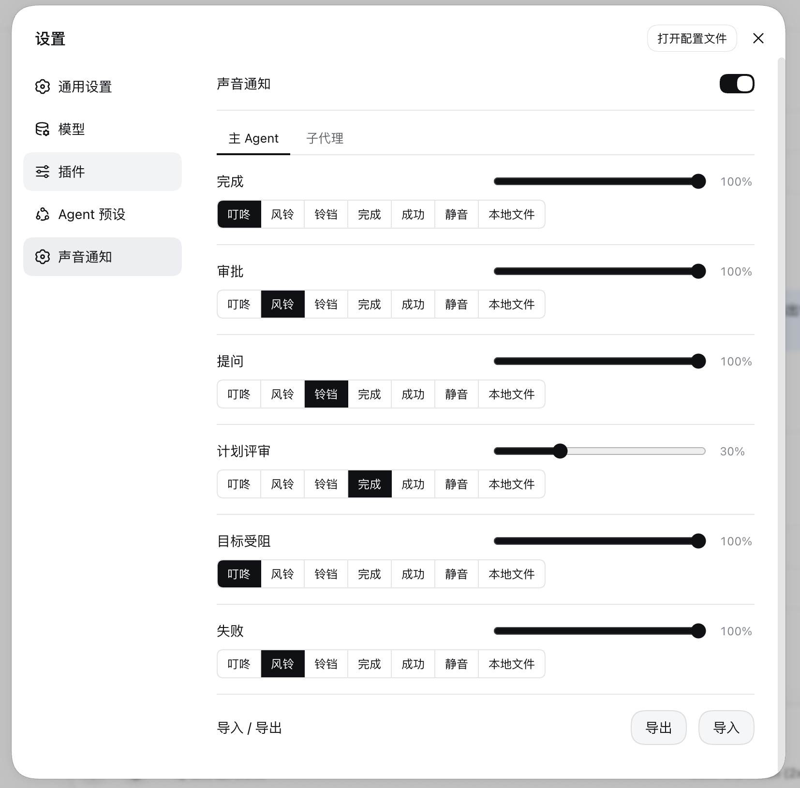

# dsh-sound

[English](README.md) | 中文

DeepSeek Harness（DSH）Web 端插件：**任务完成后播放通知铃声**，并在**需要人介入时**
（审批、提问、计划评审、目标受阻、任务失败）播放注意提示音。

> 📬 **已提交至 [Awesome DSH Plugin](https://github.com/awesome-dsh-plugin/awesome-dsh-plugin)** — [PR #752](https://github.com/awesome-dsh-plugin/awesome-dsh-plugin/pull/752)（等待维护者审批）

## 演示

<video src="https://github.com/user-attachments/assets/4441d222-5b74-4598-895e-fd5678641ee7" controls></video>

源文件: [`docs/demo.mp4`](docs/demo.mp4)

## 截图



## 功能

### 六类事件完全独立

每类事件**各自配置声音与音量**（0–100%）：

| 事件 | 检测来源 | 默认声音 |
|---|---|---|
| 回答完成 / 后台任务完成 | `turn/end` 且 `reason.kind === 'completed'`；任务 → `completed` | 风铃 |
| 审批请求 | `approval/requested` 帧 | 叮咚 |
| 用户提问 | `question/requested` 帧（不满足计划评审特征） | 叮咚 |
| 计划评审 | `question/requested` 帧（单问题 + 计划评审意图） | 叮咚 |
| 目标受阻 | goal 投影进入 `blocked` | 叮咚 |
| 后台任务失败 / 循环失败 | 任务 → `failed`；`turn/end` 且 `error`；`host/agent-error` | 铃铛 |

- **完成事件**受「当前会话不响铃」限制；**注意事件**（审批/提问/计划评审/目标受阻/失败）始终响铃。
- 用户停止（`aborted`）、`killed` 任务、`max-tokens` / `blocked` / `interrupted` 不响完成音。
- 事件由连接层帧流（`events.mux` + `events.host`）精确检测。mux 打开时回放的
  未决审批/提问（刷新恢复）不响；同一 `rpcId` 只响一次。
- 事件流不可用、或连续解包失败时自动降级为快照 diff。
- **多标签页**：同时打开多个标签页时同一次事件只响一声（BroadcastChannel 决胜）；
  单标签页立即播放，不做 40ms 握手。

### 子代理事件独立通道

子代理来源的事件与主 agent 分开检测、独立控制：

- **一次性子代理任务** — `session/jobs` 中 `kind === 'subagent'` 的任务（并行委派时
  每个子代理完成都会响主完成音的扰民问题由此解决）；
- **子代理会话** — 会话行带 `origin: 'subagent'` / `parentId` 的事件（可继续子代理），
  包括子会话回合结束、审批、提问、目标受阻与失败。

设置面板新增**子代理事件**分区：六个事件行（声音来源与音量控件与主事件一致），
外加一个「忽略子代理事件」总开关。子代理六类声音默认全部静音，主 agent 事件行为不变。

### 声音来源

设置面板里每类事件用 **Radio.Group + Radio.Button** 选择声音：

- **内置合成音** — 叮咚 / 风铃 / 铃铛 / 完成 / 成功，Web Audio 实时合成，无需音频文件；
- **静音** — 该事件不响；
- **本地文件** — 选择任意 MP3/WAV 等文件；选中后**该事件行下方会出现文件选择**。
  上传文件存入 IndexedDB（`dsh-sound-audio`），不受 localStorage 容量限制。

### 设置面板（设置 → 声音通知）

总开关与配置导入/导出保持常驻；**主 Agent / 子代理** 两个 Tab 切换面板：
主 Tab 是六类主事件行，子代理 Tab 是六类子代理事件行加「忽略子代理事件」开关。
每个事件行标题行右侧为音量滑块，下方为 Radio.Button 分段选择（点击即选中并播放）；
选「本地文件」时行下方出现选择/更换按钮与文件名。

## 安装

需要支持 bundle 插件的 DSH 版本（`dsh.profile.bundles` + `dsh.bundle.patch`），
且 PATH 中有 `pnpm`（`corepack enable` 或 `npm i -g pnpm`）。

```sh
# 一键安装：pnpm 安装依赖并把本包加入 profile 的 bundles 层
dsh plugin --profile web add @ai-galaxy/dsh-sound

# 重启服务（或刷新页面），打开 设置 → 声音通知 即可配置
```

其他 profile 同理：`dsh plugin --profile <name> add @ai-galaxy/dsh-sound`。

想跟进未发布的 `main` 时，可从 GitHub 源安装：

```sh
dsh plugin --profile web add github:AI-Galaxy-GPU/dsh-sound
```

### 手动安装（无 pnpm 时）

1. 把本包及依赖（`@deepseek-ai/schemastery`、`@deepseek-ai/cosmokit`、`@standard-schema/spec`）
   复制到 `$DSH_HOME/profiles/web/node_modules/`；
2. 在 `$DSH_HOME/profiles/web/package.json` 的 `dsh.profile.bundles` 中追加 `"@ai-galaxy/dsh-sound"`；
3. 重启 `dsh web`。

## 配置持久化

- 客户端配置保存在浏览器 **localStorage**（键 `dsh-sound:config`），读取时做字段校验与默认值兜底。
  上传的本地音乐存入 **IndexedDB**（`dsh-sound-audio`），不受 localStorage 容量限制。
- 配置键：`enabled`、`quietCurrent`、`ignoreSubagent`，以及六个主声音 + 六个主音量字段——
  `completionSound` / `approvalSound` / `questionSound` / `planReviewSound` /
  `goalBlockedSound` / `failureSound`（内置键 / `none` / `local` / `data:` URL /
  `audio:<id>`）与 `completionVolume` … `failureVolume`（0–1）；子代理通道另有对应的
  `subagentCompletionSound` … `subagentFailureSound` 与
  `subagentCompletionVolume` … `subagentFailureVolume`（声音默认全部 `none`）。
  `localFiles` 记住每类事件（`completion` … 与 `subagent-completion` …）上次选的
  本地文件，切到内置音再切回时不丢。
- **0.2.0 配置自动迁移**：旧配置的 `defaultSound` 迁为 `completionSound`，
  voice/TTS 值降级为该类默认音，`workspaces` / `debounceMs` / 全局 `volume` /
  语音设置等旧字段一律忽略。
- **导出 / 导入**：设置面板可把完整配置下载为 JSON（IndexedDB 音频引用内嵌为 data URL），
  也可从 JSON 文件恢复——换浏览器 / 换设备无需重新配置。
- 宿主端同时注册 `dsh-sound` 设置命名空间：rc.6 的 settings API 白名单
  （`dsh-host-apiproxy` 的 `WEB_SETTINGS_NAMESPACES`）不会把第三方命名空间暴露给浏览器，
  该注册为平台开放暴露机制后的无缝迁移预留（客户端存储接口外形与 settingsScope 一致）。

## 开发

```sh
npm test      # 宿主端 + 客户端 100 余项自动化断言（Node 即可，无需浏览器）
npm run check # 语法检查
```

结构：

> **开发注意**：profile 的 pnpm 使用 `nodeLinker: hoisted`，安装时会**拷贝**
> `file:` 依赖到 `node_modules`——直接改本仓库不会立即生效，需要
> 重新执行 `pnpm --dir ~/.dsh/profiles/web update @ai-galaxy/dsh-sound`，或把
> `~/.dsh/profiles/web/node_modules/@ai-galaxy/dsh-sound` 换成指向本目录的软链。
> Web 服务按请求读取 bundle 内容（只有 boot 页的 rev 哈希在启动时缓存），
> 刷新拷贝后浏览器硬刷新（Cmd+Shift+R）即可，无需重启服务。

- `lib/index.js` — 宿主端：注册 settings 命名空间（schemas 校验 + 默认值）
- `lib/client.js` — 浏览器端 bundle：事件检测、声音引擎（Web Audio / IndexedDB 音频）、设置面板
- `lib/types/index.d.ts` — 宿主端类型声明
- `cordis.patch.yml` — bundle 补丁层（插入 `dsh-sound` 行）
- `tools/` — 测试与验收脚本（不随 npm 包发布）

## 发布

以 `@ai-galaxy/dsh-sound` 发布（需要 `ai-galaxy` npm 组织成员权限；
`publishConfig.access` 已设为 `public`）。

```sh
npm login                       # 登录 npm（建议开启 2FA）
npm publish --access public
```

## 许可证

[MIT](LICENSE)
